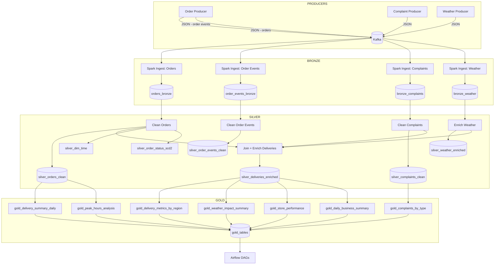

--- docs/architecture.md ---

```mermaid
flowchart TD

    subgraph PRODUCERS
        A1[Order Producer] -->|JSON - orders| Kafka1[(Kafka)]
        A1 -->|JSON - order events| Kafka1
        A2[Complaint Producer] -->|JSON| Kafka1
        A3[Weather Producer] -->|JSON| Kafka1
    end

    subgraph BRONZE
        Kafka1 --> B1[Spark Ingest: Orders] --> Ice1[(orders_bronze)]
        Kafka1 --> B4[Spark Ingest: Order Events] --> Ice8[(order_events_bronze)]
        Kafka1 --> B2[Spark Ingest: Complaints] --> Ice2[(bronze_complaints)]
        Kafka1 --> B3[Spark Ingest: Weather] --> Ice3[(bronze_weather)]
    end

    subgraph SILVER
        Ice1 --> S1[Clean Orders] --> Ice5[(silver_orders_clean)]
        Ice8 --> S5[Clean Order Events] --> Ice9[(silver_order_events_clean)]
        Ice2 --> S2[Clean Complaints] --> Ice6[(silver_complaints_clean)]
        Ice3 --> S3[Enrich Weather] --> Ice7[(silver_weather_enriched)]

        S1 & S2 & S3 --> S4[Join + Enrich Deliveries] --> Ice4[(silver_deliveries_enriched)]

        S1 --> Dim1[silver_dim_time]
        S1 --> Dim2[silver_order_status_scd2]
    end

    subgraph GOLD
        Ice4 --> G1[gold_delivery_metrics_by_region]
        Ice6 --> G2[gold_complaints_by_type]
        Ice5 --> G3[gold_delivery_summary_daily]
        Ice5 --> G4[gold_peak_hours_analysis]
        Ice4 --> G5[gold_weather_impact_summary]
        Ice4 --> G6[gold_store_performance]
        Ice4 --> G7[gold_daily_business_summary]

        G1 & G2 & G3 & G4 & G5 & G6 & G7 --> Final[(gold_tables)]
    end

    Final --> Airflow[Airflow DAGs]
```
