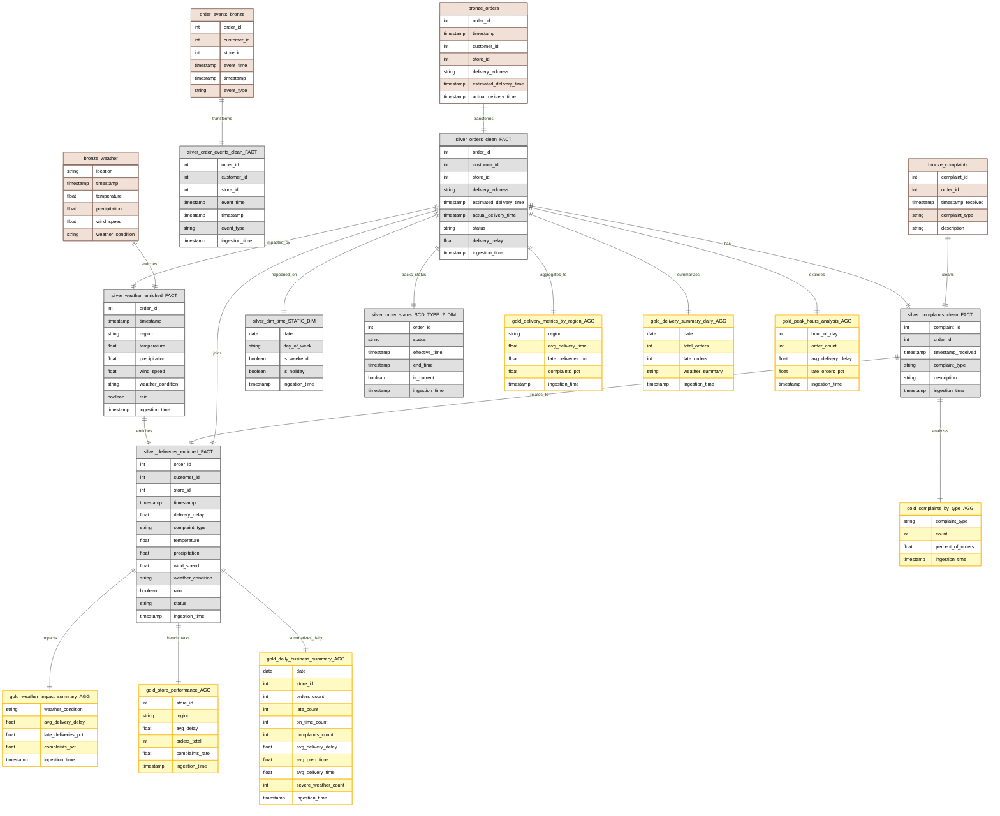

--- docs/mermaid_data_model.md ---

```mermaid
erDiagram
  classDef bronze fill:#f0e0d6,stroke:#8d6e63,color:#000;
  classDef silver fill:#e0e0e0,stroke:#757575,color:#000;
  classDef gold fill:#fff9c4,stroke:#fbc02d,color:#000;

  bronze_orders ||--|| silver_orders_clean_FACT : transforms
  order_events_bronze ||--|| silver_order_events_clean_FACT : transforms
  bronze_complaints ||--|| silver_complaints_clean_FACT : cleans
  bronze_weather ||--|| silver_weather_enriched_FACT : enriches

  silver_orders_clean_FACT ||--|| silver_complaints_clean_FACT : has
  silver_orders_clean_FACT ||--|| silver_weather_enriched_FACT : impacted_by
  silver_orders_clean_FACT ||--|| silver_deliveries_enriched_FACT : joins
  silver_complaints_clean_FACT ||--|| silver_deliveries_enriched_FACT : relates_to
  silver_weather_enriched_FACT ||--|| silver_deliveries_enriched_FACT : enriches
  silver_orders_clean_FACT ||--|| silver_dim_time_STATIC_DIM : happened_on
  silver_orders_clean_FACT ||--|| silver_order_status_SCD_TYPE_2_DIM : tracks_status

  silver_orders_clean_FACT ||--|| gold_delivery_metrics_by_region_AGG : aggregates_to
  silver_complaints_clean_FACT ||--|| gold_complaints_by_type_AGG : analyzes
  silver_orders_clean_FACT ||--|| gold_delivery_summary_daily_AGG : summarizes
  silver_orders_clean_FACT ||--|| gold_peak_hours_analysis_AGG : explores
  silver_deliveries_enriched_FACT ||--|| gold_weather_impact_summary_AGG : impacts
  silver_deliveries_enriched_FACT ||--|| gold_store_performance_AGG : benchmarks
  silver_deliveries_enriched_FACT ||--|| gold_daily_business_summary_AGG : summarizes_daily

  bronze_orders {
    int order_id
    timestamp timestamp
    int customer_id
    int store_id
    string delivery_address
    timestamp estimated_delivery_time
    timestamp actual_delivery_time
  }
  class bronze_orders bronze

  order_events_bronze {
    int order_id
    int customer_id
    int store_id
    timestamp event_time
    timestamp timestamp
    string event_type
  }
  class order_events_bronze bronze

  bronze_complaints {
    int complaint_id
    int order_id
    timestamp timestamp_received
    string complaint_type
    string description
  }
  class bronze_complaints bronze

  bronze_weather {
    string location
    timestamp timestamp
    float temperature
    float precipitation
    float wind_speed
    string weather_condition
  }
  class bronze_weather bronze

  silver_orders_clean_FACT {
    int order_id
    int customer_id
    int store_id
    string delivery_address
    timestamp estimated_delivery_time
    timestamp actual_delivery_time
    string status
    float delivery_delay
    timestamp ingestion_time
  }
  class silver_orders_clean_FACT silver

  silver_order_events_clean_FACT {
    int order_id
    int customer_id
    int store_id
    timestamp event_time
    timestamp timestamp
    string event_type
    timestamp ingestion_time
  }
  class silver_order_events_clean_FACT silver

  silver_complaints_clean_FACT {
    int complaint_id
    int order_id
    timestamp timestamp_received
    string complaint_type
    string description
    timestamp ingestion_time
  }
  class silver_complaints_clean_FACT silver

  silver_weather_enriched_FACT {
    int order_id
    timestamp timestamp
    string region
    float temperature
    float precipitation
    float wind_speed
    string weather_condition
    boolean rain
    timestamp ingestion_time
  }
  class silver_weather_enriched_FACT silver

  silver_deliveries_enriched_FACT {
    int order_id
    int customer_id
    int store_id
    timestamp timestamp
    float delivery_delay
    string complaint_type
    float temperature
    float precipitation
    float wind_speed
    string weather_condition
    boolean rain
    string status
    timestamp ingestion_time
  }
  class silver_deliveries_enriched_FACT silver

  silver_dim_time_STATIC_DIM {
    date date
    string day_of_week
    boolean is_weekend
    boolean is_holiday
    timestamp ingestion_time
  }
  class silver_dim_time_STATIC_DIM silver

  silver_order_status_SCD_TYPE_2_DIM {
    int order_id
    string status
    timestamp effective_time
    timestamp end_time
    boolean is_current
    timestamp ingestion_time
  }
  class silver_order_status_SCD_TYPE_2_DIM silver

  gold_delivery_metrics_by_region_AGG {
    string region
    float avg_delivery_time
    float late_deliveries_pct
    float complaints_pct
    timestamp ingestion_time
  }
  class gold_delivery_metrics_by_region_AGG gold

  gold_complaints_by_type_AGG {
    string complaint_type
    int count
    float percent_of_orders
    timestamp ingestion_time
  }
  class gold_complaints_by_type_AGG gold

  gold_delivery_summary_daily_AGG {
    date date
    int total_orders
    int late_orders
    string weather_summary
    timestamp ingestion_time
  }
  class gold_delivery_summary_daily_AGG gold

  gold_peak_hours_analysis_AGG {
    int hour_of_day
    int order_count
    float avg_delivery_delay
    float late_orders_pct
    timestamp ingestion_time
  }
  class gold_peak_hours_analysis_AGG gold

  gold_weather_impact_summary_AGG {
    string weather_condition
    float avg_delivery_delay
    float late_deliveries_pct
    float complaints_pct
    timestamp ingestion_time
  }
  class gold_weather_impact_summary_AGG gold

  gold_store_performance_AGG {
    int store_id
    string region
    float avg_delay
    int orders_total
    float complaints_rate
    timestamp ingestion_time
  }
  class gold_store_performance_AGG gold

  gold_daily_business_summary_AGG {
    date date
    int store_id
    int orders_count
    int late_count
    int on_time_count
    int complaints_count
    float avg_delivery_delay
    float avg_prep_time
    float avg_delivery_time
    int severe_weather_count
    timestamp ingestion_time
  }
  class gold_daily_business_summary_AGG gold
```